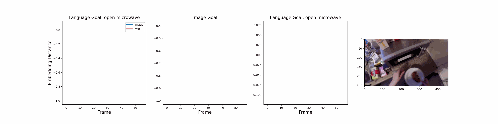

# LIV: Language-Image Representations and Rewards for Robotics Control
International Conference on Machine Learning (ICML), 2023
#### [[Project Page]](https://penn-pal-lab.github.io/LIV) [[Arxiv]](https://arxiv.org/abs/2306.00958)[[Paper]](https://www.seas.upenn.edu/~jasonyma/liv_paper.pdf) [[Dataset]](liv/dataset/README.md) [[HuggingFace Model Page]](https://huggingface.co/jasonyma/LIV)

[Jason Yecheng Ma](https://www.seas.upenn.edu/~jasonyma/)<sup>1</sup>, [Vikash Kumar](https://vikashplus.github.io/)<sup>2</sup>, [Amy Zhang](https://amyzhang.github.io/)<sup>2</sup>, [Osbert Bastani](https://obastani.github.io/)<sup>1</sup>, [Dinesh Jayaraman](https://www.seas.upenn.edu/~dineshj/)<sup>1</sup>

<sup>1</sup>University of Pennsylvania, <sup>2</sup>Meta AI

This is the official repository for LIV, an algorithm for pre-training, fine-tuning, and reward learning for language-conditioned robotic control. This repository contains examples for using the pre-trained LIV model as well as training LIV from scratch using any custom video dataset.


## Table of Contents  
[Installation](#installation)  

[LIV Usage Examples](#liv-usage-examples)

[LIV Training](#training-liv-representation)

[LIV Fine-Tuned Reward Curve Visualization](#multi-modal-reward-curve-generation)

## Installation
Create a conda environment where the packages will be installed.
```
conda create --name liv-env python=3.9
conda activate liv-env
```
Then, in the root directory of this repository, run:
```
pip install -e .;
cd liv/models/clip; pip install -e .;
```

## LIV Usage Examples
Quick start:
```
from liv import load_liv
liv = load_liv()
liv.eval()
```

The following code snippet demonstrates an example for loading the model as well as performing inference on an example image and text (```python liv/examples/liv_static.py```):
```
import clip
import torch
import torchvision.transforms as T
from PIL import Image 

from liv import load_liv

device = "cuda" if torch.cuda.is_available() else "cpu"

# loading LIV
liv = load_liv()
liv.eval()
transform = T.Compose([T.ToTensor()])

# pre-process image and text
image = transform(Image.open("sample_video/frame_0000033601.jpg")).unsqueeze(0).to(device)
text = clip.tokenize(["open microwave", "close microwave", "wipe floor"]).to(device)

# compute LIV image and text embedding
with torch.no_grad():
    img_embedding = liv(input=image, modality="vision")
    text_embedding = liv(input=text, modality="text")

# compute LIV value
img_text_value = liv.module.sim(img_embedding, text_embedding)
# Output: [ 0.1151, -0.0151, -0.0997]
```

We have also included an example for generating multi-modal reward curves on text-annotated videos. You can try it here:
```
cd liv/examples
python liv_example.py
```
This should generate the following animated reward curves in `liv/examples`:

<p float="left">

</p>


## Training LIV Representation
Our codebase supports training LIV on both the EpicKitchen dataset that was used in pre-training our released LIV model as well as any custom video dataset. The video dataset directory should use the following structure:
```
my_dataset_path/
    video0/
        0.png
        1.png
        ...
    video1/
    video2/
    ...
    manifest.csv
```
The ```manifest.csv``` file should contain rows of ```directory, text, num_frames```, which indicates the absolute path, text annotation, and length of each video, respectively.

Then, you can use LIV to fine-tune a pre-trained vision-language model (e.g., LIV, CLIP) on your dataset by (1) adding a ``<my_dataset_name>.yaml`` file that specifies the dataset name and path in ``/cfgs/dataset``:
```
python train_liv.py training=finetune dataset=my_dataset_name
```

We have provided an [example](liv/dataset/README.md) of LIV fine-tuning using the realrobot dataset we used in the paper. 

For EpicKitchen or equivalent large-scale pre-training, we suggest using config ``pretrain.yaml`` (the config for the released LIV model):
```
python train_liv.py  training=pretrain dataset=epickitchen
```
Each training run will generate a training run folder under ``train_liv_realrobot`` and the reward curves for intermediate model snapshots will be saved in ``\reward_curves`` of the run folder. 

## Multi-Modal Reward Curve Generation
We can use the same training code to also only generate the (animated) reward curves by setting ``eval=True`` 
```
python train_liv.py eval=true dataset=epickitchen animate=True
```

We can also specify a model path (e.g., ``snapshot.pt`` saved in a run folder) and generate reward curves on the dataset the model is LIV fine-tuned with:
```
python train_liv.py eval=True load_snap=PATH_TO_LIV_MODEL dataset=realrobot animate=True 
```
In the run folder, you should see animated reward curves like the following:
<p float="left">

</p>


## License

The source code in this repository is licensed under the MIT License.

## Citation
If you find this repository or paper useful for your research, please cite
```
@article{ma2023liv,
  title={LIV: Language-Image Representations and Rewards for Robotic Control},
  author={Ma, Yecheng Jason and Liang, William and Som, Vaidehi and Kumar, Vikash and Zhang, Amy and Bastani, Osbert and Jayaraman, Dinesh},
  journal={arXiv preprint arXiv:2306.00958},
  year={2023}
}
```

## Ackowledgements

Parts of this code are adapted from [VIP](https://github.com/facebookresearch/vip) and [CLIP](https://github.com/openai/CLIP).
